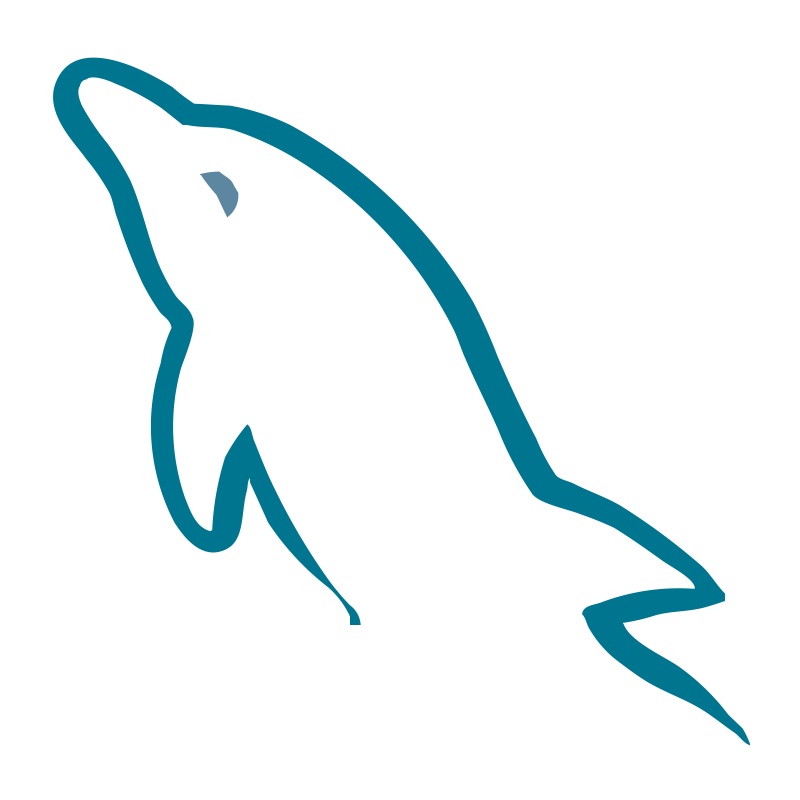

## Hi there! I'm Matilde 👋

### 📖 About Me
* 🎓 Bachelor of Computer Science and Engineering @ University of Beira Interior (2020-2023)
* I find myself very creative and capable of solving many problems
* I'm interested in the areas...
  - Web Development
  - Mobile App Development
  - Game Development
  - Information Security

### ⬆ My ongoing pursuits
* 🔭 I'm currently working on my university Final Project!
* 🌱 I'm learning Flutter
* In the near future I plan to...
  - ✈️ Travel a lot!
  - Learn Ruby, TypeScript, Angular and React
  - Learn more about game development

### 💻 I have experience with

&nbsp;

&nbsp;

&nbsp;

&nbsp;

&nbsp;

&nbsp;

### ⚡ Fun facts:
* I love video games
* Drawing is one of my favorite hobbies
* I am gaining interest in yoga
* Sometimes I like to do some gardening :)

------------------------------------------------------------------------------------------------------------------------------------------------------------------
### 📫 How to reach me

 
Email: matilderosa216@gmail.com
<!--
**khajiits/khajiits** is a ✨ _special_ ✨ repository because its `README.md` (this file) appears on your GitHub profile.

Here are some ideas to get you started:

- 🔭 I’m currently working on ...
- 🌱 I’m currently learning ...
- 👯 I’m looking to collaborate on ...
- 🤔 I’m looking for help with ...
- 💬 Ask me about ...
- 📫 How to reach me: ...
- 😄 Pronouns: ...
- ⚡ Fun fact: ...
-->
